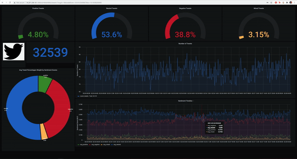
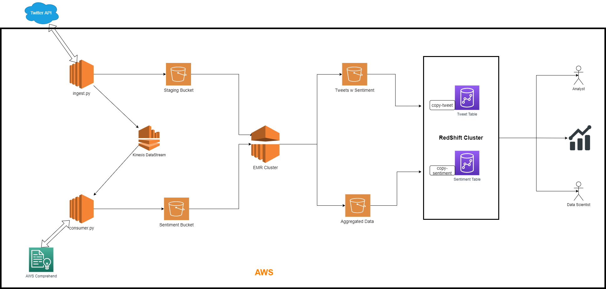

# Twitter Sentiment Analysis
The article on the project is also published on Towards Data Science. You can read it [here](https://towardsdatascience.com/sentiment-analysis-on-live-tweets-with-ad-hoc-batch-processing-using-aws-f77036dc337) .

Grafana Dashboard Example:



Table of Contents:

1. [Objective](#Objective)
2. [Project Overview](#Project-Overview)
3. [System Architecture](#System-Architecture)
4. [Installation and Usage](#Installation-and-usage)
6. [Limitation](#Limitation)

### Objective

Build a scalable, fault tolerant and high available (ad-hoc) batch processing framework to ingest, process and perform sentiment analysis on tweets pertaining to a topic with specified time period. 

### Project Overview

Twitter API will be used to fetch tweet data from twitter. The data is fetched with 15 minutes time bursts looking back at 100 tweets for every 15 minutes between specified timeframe. The tweet texts along with some user metadata is stored into the staging area. The `tweet_id` and `text` (tweet itself) is pushed to the Kinesis data stream for further processing. 

Kinesis data streamed is consumed and for each tweet, sentiment analysis is performed using AWS Comprehend ML as a service. The sentiment analysis API returns the overall sentiment of the text in Positive, Negative, Neutral or Mixed categories along with the final verdict as Label. Label is simply a string which represents highest probability of all of the specified categories. Consumer consumes this results and writes the data to Sentiment bucket. 

Here, each Kinesis data stream consists of at most 100 tweets. Once the data is ingested and all Kinesis data streams are processed and Elastic Map Reduce (EMR) service is used to process the data. EMR is  built to process data in distributed manner using Hadoop, Spark framework with Hive in fully managed clustered manner. We can ssh into master instance to perform operations on the cluster. The script for the EMR that uses `pyspark` is first copied from the S3 bucket into the EMR master instance via aws cli.  EMR loads staging and sentiment data from the buckets and merges them using `tweet_id`. It then performs aggregations based on 15 minutes time window to calculate average sentiments and total tweets as a percentage in each sentimental category in that timeframe. That way, the aggregated data can be easily visualized without performing aggregations on thousands of tweets every time a user wants to see the analytics. EMR stores all the tweets data with merged results in s3 bucket. The aggregated data is stored in a separate location (different s3 folder or different s3 bucket). This way, we have a transactional view of all tweets and their prevailing sentiments and a datamart with aggregated results with the time window which can be used to visualize the data with time as a parameter. 

AWS Redshift is a fully managed datawarehouse system where tables are made using SQL commands. These tables would hold the transactional and aggregated data stored into the bucket. To load the data stored in the s3 buckets to the Redshift datawarehouse, COPY commands are used. A connection is made to the Redshift Cluster (SQL Workbench or Redshift cluster query editor) and COPY commands are performed over the cluster to pull data from the buckets and into the tables. 

Grafana over on an EC2 instance is used for visualization. 

### System Architecture

The project runs on AWS exposing some AWS services:

1. S3: For storage of staging data, sentiment data, tweet transactional data, aggregated data

2. EC2: To run `ingest.py` and `consumer.py`. You can also run them on your own laptop. This is optional. 

3. EMR Cluster: To process all data produced in batches. Merge data and run aggregation before storing them back to S3.

4. Redshift Cluster: Ultimately data would end up in the Redshift. 

5. AWS Comprehend: In order to get sentiment from tweet text data, AWS Comprehend is used. This can be replaced with local NLP model or an open source or enterprise version ML model with HTTP end point. Comprehend is used through `boto3` python API here. 

   

Here S3 is used for primary storage for each processing unit. AWS S3 provides a very cheap data storage capability for flat files with high availability and use-case flexibility.  

Ingestion is kept decoupled from NLP workflow because NLP is a separate entity altogether. This way, ingestion is independent from ML workflow. This decoupling allows us to run more than one NLP services together in parallel from ingestion without delaying the data acquisition. 

AWS Kinesis works as a temporary storage mechanism for faster retrieval for further downstream components and NLP. Once data is produced, it is consumed by the consumer. There can be more than one consumer based on the kind of analytics performed on the text and all of them would be independent with one another. Moreover, if of of the tasks fail, it would easier to run it again in complete isolation in terms of processing and storage. 

EMR provides a fleet of high power EC2 Instances with a highly in used distributed processing frame work like Hadoop Spark. It has the capacity to perform data processing on Terabyte or Petabytes of data. EMR writes the data to S3 buckets rather than directly writing it to Redshift for several reasons. There can be number of different sub-systems which would like to consume the processed and aggregated data. With S3 storage is extremely cheaper than Redshift, where we pay for space by hour. Moreover, S3 read/writes are cheaper than Redshift reads where we pay for each request and its data packet size. Redshift's primary goal is to provide a big picture of the data and be able to query historical data faster. Redshift's data querying is much faster than S3. Hence, S3 is used to leverage cost when this system may be a part of a bigger architecture with many microservices. 

Once the data is loaded into the Redshift databases, Data Visualization systems like Grafana can pull the data and visualize it. 

#### Installation and Usage

In order to install the project, you can download this repo to your local machine. 

You need to have `docker-compose` install over at the same local machine as well. 

Since this project uses a lot of cloud assets make sure you have below assets up and running over at AWS. 

1. S3 Bucket: You will need a bucket set up to hold staging, sentiments and analytics data. 
2. Kinesis Stream: You will need to set up a Kinesis Data Stream to hold each burst of tweet as a batch for NLP model to be called for each packet. 
3. EMR Cluster: To process, merge and transform data, the data EMR is used. Make sure that can access S3 buckets. 
4. Redshift Cluster: Spin up a cluster of create necessary tables on the already running cluster. 
5. Grafana: Make sure you have the dashboard ready to visualize the data. This can be installed locally as well. 

Once all of aws assets are ready to be used, you need to update `secret.ini`. 

```
[twitter-api]
consumer_key=<TWITTER_CONSUMER_KEY>
consumer_secret=<TWITTER_CONSUMER_SECRET>
access_token=<TWITTER_ACCESS_TOKEN>
access_token_secret=<TWITTER_ACCESS_TOKEN_SECRET>
bearer_token=<TWITTER_BEARER_TOKEN>

[aws]
aws_access_key_id=<AWS_KEY>
aws_secret_access_key=<AWS_SECRET>
region_name=<AWS_REGION>
```

Currently this servers as a placeholder. You need to update `[twitter-aoi]` with your own twitter api credentials and `[aws]` as per the already created IAM role or new one. 

Next, in order to pass pipeline specific parameters, update the `app.yaml`.

```
# twitter api specific params
# search_url: pass the base url that servers as the main search function with api version. If changed, you need to change other fields too
# query: search term or query eg: biden
# tweets_fields, user_fields: data that we need from the api
# start_time, end_time: timestamp in YYY-MM-DDThh:mm:ss format
# freq: Offset alias

[tweet-search]
search_url:https://api.twitter.com/2/tweets/search/recent
query:<SEARCH TERM>
tweets_fields:tweet.fields=text,created_at,referenced_tweets
user_fields:user.fields=username,name,verified,location
start_time:<START_TIMESTAMP>
end_time:<END_TIMESTAMP>
freq:15T

# storage of the staging response jsons
# mode: mode can be either local or s3
# staging_local_dir, sentiment_local_dr: directory in the local machine where staging responses and sentiment scores will be stored
# staging_s3_folder, sentiment_s3_folder: the s3 bucket/folder path where staging responses and sentiment scores will be sotred
[storage]
mode:s3
staging_local_dir:app_data/responses
sentiment_local_dir:app_data/sentiments
s3_bucket:twitter-data-sm
staging_s3_key:staging
sentiment_s3_key:sentiments

# kinesis stream that you have setup
[kinesis]
streamname:tweet_stream
```

I have setup a bucket named `twitter-data-sm` and a kinesis stream named `tweet_stream` so I have kept them as is in `app.yaml`. You will need to update that. You can use `mode` value to debug your pipeline to occasional local data load rather than having that on S3. 

Here `freq` param takes any valid `timeseries-offset-alias` . More about it can be found [here](https://pandas.pydata.org/pandas-docs/stable/user_guide/timeseries.html#timeseries-offset-aliases) .

The deployment is eased by `docker-compose`. 

It requires some directories to be mounted for the docker services. That means there is a bi-directional synchronization between directory in host system and container which is running. 

1. `./config`: contains configuration files 
2. `./module`: contains python files
3. `./app_data`: this directory has two subdirectories `responses/` and `sentiments/`. This is optional as it is only used when run with `mode:local`. 

Once downloaded and `app.yaml` and `secret.ini` file updated, go to the directory containing the files and follow below steps. 

1. In order to be able run the docker services, first 

   Run `docker-compose build`

   It will build a service called `twipy` . 

2. Run `consumer.py` from `docker-compose`.

   Run `docker-compose run twipy python /app/module/consumer.py`

   Currently it would show `No Updates` , that is because we are yet to start `ingest.py`

3. Run `ingest.py` from `docker-compose`

   Run `docker-compose run twipy python/app/module/ingest.py`

   Now we have started ingesting the tweets from `start_time` to `end_time` inclusive. You can see then in real time with 10sec delay on consumer.py 

   After ingesting stops, data is stored in either s3 bucket or local directory depending on the `[storage][mode]` specified in the `app.yaml` file. `staging` and  `sentiment` directories would hold json documents with raw tweets and their metadata and sentiments comprehended from AWS Comprehend NLP service.

4. EMR: ssh into the emr cluster with putty using `hadoop@<EMR-CLUSTER-DNS>` on port 22 using private key and copy `emr-script.py` from s3 bucket to emr master cluster instance. 

   Use `aws s3 cp s3://<S3-BUCKET-WITH-emr-script.py>/emr-script.py .`

5. `spark-submit`: Now we are ready to submit this task to the spark cluster. 

   Use `spark-submit ./emr-script.py`	

   `emr-script.py` provides two csv files into the specified buckets. 

   1. File containing entire dataset with all tweets and their individual results. 
   2. File containing aggregated results with 15 mins time window containing average sentiment score and percentage weight of each sentiment with total number of absolute tweets for that 15 mins window. 

6. Redshift: Now, we are ready to load the processed data into the AWS Redshift datawarehouse. 

   For this, you need to create two tables. 

   1. `tweet`: A table to have a historical transactional data for all tweets and their results.
   2. `sentiment`: Aggregated data for every 15 minute time window with avg scores, percentage number of tweets and total tweets in that timeframe. 

   Use `create-table.sql` and `create-sentiment.sql` from `redshift` to create these tables. 

   Now, it is time to fill data in these tables. 

   Use COPY command from AWS to load data from S3 into AWS Redshift Cluster.  Use `copy-tweet` and `copy-sentiment` to fill up `tweet` and `sentiment` tables into redshift. COPY commands are also in `redshift` directory of the project. 

7. Provision a Linux/Windows machine on AWS. Make sure it has the access to Redshift Cluster. Install Grafana on it. Connect it to the Redshift cluster and start visualizing the data. 

   I ran the entire pipeline to collect around 33K tweets with query string `biden` for 4 days. 

   The interactive dashboard  below shows Percentage tweets for each category in the first row with gauge panels. 

   In the second row, I am showing total number of tweets as a label and the tweets collected for each 15 mins interval over the timeline. 

   In the last row, I am showing a pie chart with average sentiment scores (NLP) for each category for the time period along with its timeline. 

   

### Limitation

1. Ingestion works sequentially. Upon a fault, the system may be in a state where we have to run the ingestion again starting the last partition. It should be parallelize since previous loads are independent from current on going loads. 

   Possible Solution: A Scheduler like Airflow can be used to run partitioned parallel data ingestion. 

2. Consumer works as a stand alone piece of consuming unit. It works sequentially. It is heavily dependent on the third-party API (API which is not a part of this system). As a result, any regular delay in the third party API may result in massive delay in consuming and with each consuming cycle, there can be increment of data as producer keeps on producing data. 

   Possible Solution: There should be a 1:1 relationship between producer and consumer data packages. AWS Kinesis Firehose works as a Data Stream Delivery system. A Lambda function can be used for each data stream produced which can handle processing of each stream in a serverless manner. 

